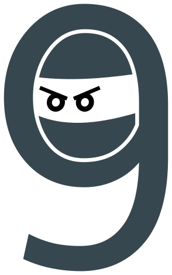

# Mnemonic Ninja

Website to convert between a number and its corresponding word to aid in memorization.

## About

Mnemonic Ninja is a website written in Go that converts numbers to words
and back to aid in memorization. There are other mnemonic major converters,
but most perform conversions based on each letter instead of taking
pronunciation into account. Mnemonic Ninja uses a phonetic alphabet so that
conversions line up with the generally accepted rules.
See the [Mnemonic Ninja about page](https://mnemonic.ninja/about)
or the [mnemonic major system Wikipedia page](https://en.wikipedia.org/wiki/Mnemonic_major_system)
for more information.

View the live site at <https://mnemonic.ninja/>
